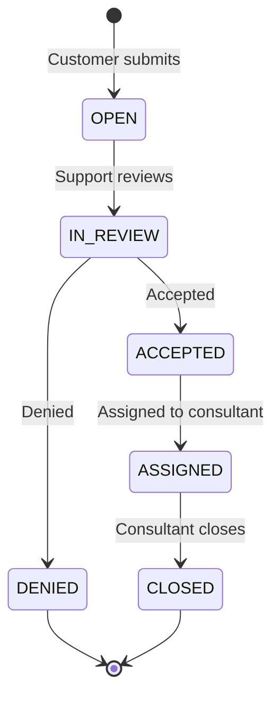

# eMagiz Ticketing System

**Team 04 · Design Project 2025/26 · University of Twente**

A full-stack support portal for [eMagiz](https://www.emagiz.com/) integration customers. Customers submit and track tickets; support triages the queue; consultants work assigned cases — all in one system with role-based access, audit logging, and real-time activity feeds.

---

## Highlights

- **Three role-specific portals** — Customer, Support, and Consultant, each with its own dashboard, navigation, and permissions
- **End-to-end ticket lifecycle** — from submission through triage, review, assignment, and closure
- **Public & internal conversation** — ticket chat for customers; team notes visible only to staff
- **Audit trail** — every status change, assignment, comment, and priority update is logged
- **Activity notifications** — bell icon and Recent Activity panels powered by the audit log
- **Operational dashboards** — stat cards, priority breakdown, and tickets-by-type charts
- **Password reset flow** — email delivery via MailHog in development

---

## Ticket Lifecycle



| Type | When to use |
|------|-------------|
| **Incident** | Something is broken or not working (errors, timeouts, failed jobs) |
| **RFC** | Request for Change — configuration, enhancement, planned update |
| **Other** | General questions or requests outside the categories above |

| Priority | Typical use |
|----------|-------------|
| **Critical** | Production down, severe integration failure |
| **High** | Significant business impact |
| **Medium** | Affects work but not critical |
| **Low** | Minor issue, workaround available |

---

## Features by Role

### Customer
- Dashboard with open tickets, waiting-for-support count, resolved-this-month, and recent updates
- Submit tickets (type, priority, description, environment, business impact)
- My Tickets list with filters, sorting, and pagination
- Ticket detail with public conversation thread
- Recent Activity feed (support actions on your tickets)
- Help centre (FAQ) and account settings

### Support
- Central dashboard with triage queue, SLA risk indicators, and charts
- **Ticket Queue** — full table with search, filters, accept/deny/assign actions
- **Triage Board** — kanban-style columns (New → Under Review → Accepted → Denied → Assigned)
- Ticket detail — review, accept, deny, assign, change priority
- User management (create users, view roles and companies)
- Global audit log viewer
- Team notes on tickets (internal, hidden from customers)

### Consultant
- Dashboard with assigned count, priority breakdown, and ticket list
- **Assigned to Me** — filterable queue of owned tickets
- Ticket detail — conversation, team notes, close ticket, update priority

---

## Tech Stack

| Layer | Technology |
|-------|------------|
| **Frontend** | Vue 3, Vue Router 4, Tailwind CSS 3, Chart.js, Lucide icons, Vite 5 |
| **Backend** | Java 17, Jakarta EE, Jersey 3 (JAX-RS), Jackson, BCrypt |
| **Server** | Apache Tomcat 10 |
| **Database** | PostgreSQL 15 (hosted) |
| **Email (dev)** | MailHog |
| **Infrastructure** | Docker, Docker Compose, Nginx |

---

## Architecture

```
┌─────────────────────────────────────────────────────────────┐
│  Browser                                                     │
│  Vue 3 SPA (hash router)                                     │
│  ┌──────────┐  ┌──────────┐  ┌──────────┐                   │
│  │ Customer │  │ Support  │  │Consultant│                   │
│  │  portal  │  │  portal  │  │  portal  │                   │
│  └────┬─────┘  └────┬─────┘  └────┬─────┘                   │
└───────┼─────────────┼─────────────┼─────────────────────────┘
        │  Bearer token (JWT-less session token in localStorage)
        ▼
┌───────────────┐     ┌───────────────────────────────────────┐
│ Nginx :80     │────▶│ Tomcat :8080  /api/*                  │
│ (production)  │     │  AuthFilter → RoleFilter → Resources  │
│ or Vite :5173 │     │  TicketResource · UserResource · …    │
└───────────────┘     └──────────────────┬────────────────────┘
                                           │
                                           ▼
                                  ┌─────────────────┐
                                  │   PostgreSQL    │
                                  └─────────────────┘
```

**Security model**
- `POST /api/users/login` returns a bearer token stored client-side
- `AuthFilter` validates the token on every protected request
- `@RolesAllowed` annotations enforce role checks per endpoint
- Frontend route guards redirect users to their role home (`/customer`, `/support`, `/consultant`)

---

## Quick Start

### Prerequisites

- [Docker](https://www.docker.com/) & Docker Compose
- Node.js 22+ (for local frontend development only)

### Run with Docker

```bash
docker compose up --build
```

| Service | URL |
|---------|-----|
| **Frontend** | http://localhost |
| **Backend API** | http://localhost:8080/api |
| **MailHog UI** | http://localhost:8025 |

> After changing Java code: `docker compose build backend && docker compose up -d backend`  
> After changing frontend code: `docker compose build frontend && docker compose up -d frontend`

### Local development (recommended for frontend work)

```bash
# Terminal 1 — backend (Docker)
docker compose up backend mailhog

# Terminal 2 — frontend with hot reload
cd frontend
npm install
npm run dev        # → http://localhost:5173
```

Vite proxies `/api` requests to `http://localhost:8080`.

### Build backend manually

```bash
cd backend
mvn package -DskipTests
# WAR output: backend/target/*.war
```

---

## REST API

Base URL: `http://localhost:8080/api`  
Authentication: `Authorization: Bearer <token>` (all routes except login and password reset)

### Auth & Users

| Method | Path | Description |
|--------|------|-------------|
| `POST` | `/users/login` | Login — returns token, userId, role |
| `POST` | `/users` | Create user |
| `GET` | `/users` | List all users |
| `POST` | `/users/password-reset` | Request password reset email |
| `PUT` | `/users/reset-password` | Complete password reset |

### Tickets

| Method | Path | Roles | Description |
|--------|------|-------|-------------|
| `POST` | `/tickets` | Customer, Support | Create ticket |
| `GET` | `/tickets` | Support | List all tickets |
| `GET` | `/tickets/{id}` | All | Get ticket by ID |
| `GET` | `/tickets/client/{clientId}` | All | Tickets by creator |
| `GET` | `/tickets/assignee/{assigneeId}` | All | Tickets by assignee |
| `PATCH` | `/tickets/{id}/status` | Staff | Update status |
| `PATCH` | `/tickets/{id}/priority` | All | Update priority |
| `PUT` | `/tickets/{ticketId}/assignee/{assigneeId}` | Support | Assign ticket |
| `GET` | `/tickets/{id}/comments` | All | List comments (internal hidden for customers) |
| `POST` | `/tickets/{id}/comments` | All | Add comment or team note |

### Audit

| Method | Path | Description |
|--------|------|-------------|
| `GET` | `/audit-logs` | All audit entries (newest first) |
| `GET` | `/audit-logs/ticket/{ticketId}` | Audit trail for one ticket |

A Postman collection is available in [`postman/`](postman/).

---

## Data Model

```
User
├── id, username, email, password (bcrypt), role, company

Ticket
├── id, title, description
├── status   OPEN | IN_REVIEW | ACCEPTED | ASSIGNED | DENIED | CLOSED
├── type     INCIDENT | RFC | OTHER
├── priority LOW | MEDIUM | HIGH | CRITICAL
├── creatorId, assigneeId, company (denormalized from creator)
└── createdAt, updatedAt

Comment
├── id, ticketId, userId, content, internal (team note flag)
└── createdAt

AuditLog
├── id, ticketId, userId, action, details
└── createdAt
```

Database migrations live in [`db/migrations/`](db/migrations/).

---

## Repository Structure

```
di26-04/
├── backend/
│   └── src/main/java/com/emagiz/
│       ├── config/       # Jersey, DB, mail
│       ├── dao/          # Data access (User, Ticket, Comment, AuditLog)
│       ├── dto/          # Request/response DTOs
│       ├── model/        # Domain entities & enums
│       ├── resource/     # JAX-RS REST endpoints
│       └── security/     # AuthFilter, RoleFilter, @RolesAllowed
├── frontend/
│   └── src/
│       ├── components/   # UI components (dashboard, tickets, sidebar, topbar)
│       ├── layouts/      # CustomerLayout, SupportLayout, ConsultantLayout
│       ├── views/        # Page-level views per role
│       └── js/
│           ├── api/      # HTTP client & endpoint wrappers
│           ├── composables/
│           └── domain/   # Catalogs, roles, activity feed logic
├── db/migrations/        # SQL migration scripts
├── postman/              # API test collection
├── docker-compose.yml
├── testing_report.md
└── security_analysis_report.md
```

---

## Frontend Routes

| Path | Role | Page |
|------|------|------|
| `/customer` | Customer | Dashboard |
| `/customer/tickets` | Customer | My Tickets |
| `/customer/submit` | Customer | Submit Ticket |
| `/customer/help` | Customer | Help & FAQ |
| `/support` | Support | Dashboard |
| `/support/queue` | Support | Ticket Queue |
| `/support/triage` | Support | Triage Board |
| `/support/users` | Support | User Management |
| `/support/audit` | Support | Audit Log |
| `/consultant` | Consultant | Dashboard |
| `/consultant/assigned` | Consultant | Assigned Tickets |

---

## Testing & Documentation

| Document | Description |
|----------|-------------|
| [`testing_report.md`](testing_report.md) | Test methods, user story coverage, results |
| [`security_analysis_report.md`](security_analysis_report.md) | Security review and threat analysis |
| [`Assignment 1/`](Assignment%201/) | SRS and mock-up report |
| [`Assignment 2/`](Assignment%202/) | Design report |
| [`Assignment 3/`](Assignment%203/) | Security analysis (PDF) |

---

## Project Management

- **Trello:** [emagiz-4](https://trello.com/b/ydJlvntw/emagiz-4)
- **GitLab:** [di26-04](https://gitlab.utwente.nl/s3536890/di26-04)

---

## Team 04

University of Twente · Design Project · 2025/26
